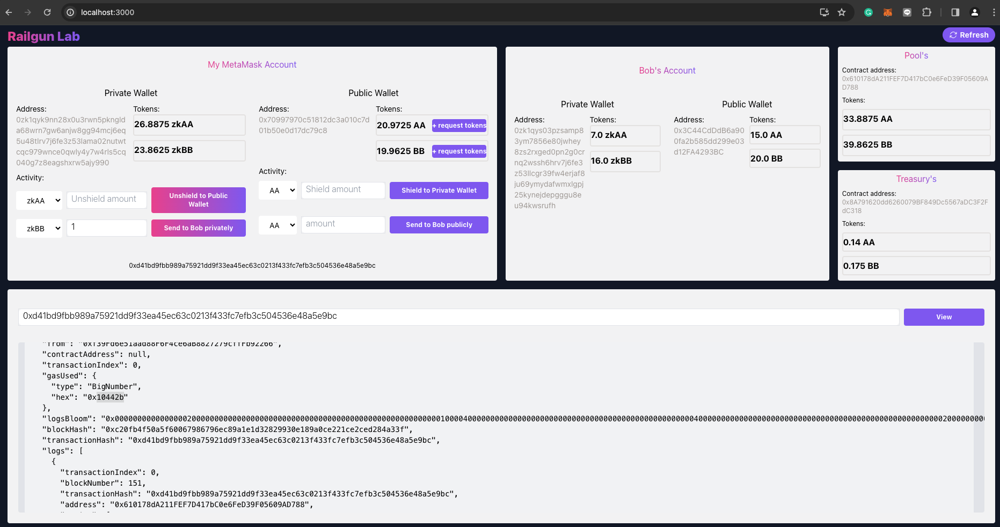
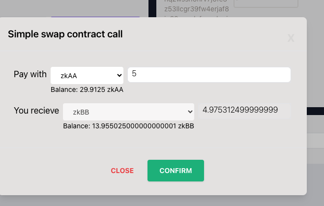

# Railgun Experimental

This project aims to experiment with the [Railgun engine SDK](https://github.com/Railgun-Community/engine) and [Railgun wallet SDK](https://github.com/Railgun-Community/wallet), integrated with the local Hardhat RPC and using my fresh new wallet as a relayer.

### Overview UI



### Swap UI



## contracts/

This directory contains modified versions of `hardhat.config.ts` and `tasks/deploy/test.ts` from the [Railgun Smart Contract](https://github.com/Railgun-Privacy/contract.git). To prepare for the demo, replace the original files with these two.

I've added the deployment of a second ERC20 contract (the script originally had only one ERC20 deployment, so I added one more) and a simple swap contract (for demonstrating swaps).

To deploy all contracts, follow these steps:

1. Open your terminal and start the Hardhat node:

   ```bash
   npx hardhat node
   ```

2. Clone the [Railgun Smart Contract](https://github.com/Railgun-Privacy/contract.git) repository and replace the `hardhat.config.ts` and `tasks/deploy/test.ts` files.

3. Install the dependencies

   ```bash
   npm i
   ```

4. Deploy the contracts to your local Hardhat network:

   ```bash
   npx hardhat deploy:test --network localhost
   ```

5. Utilize the pre-mint script `scripts/pre-mint.js` to add liquidity for swapping. Plsease edit the wallet secret key, swapping contract address, and the addresses of the two ERC20 contracts.

   ```bash
   node scripts/pre-mint.js
   ```

## backend/

This directory contains an Express server that connects to the Hardhat local node to provide services for the frontend. It includes a wallet scanner to check balances and stores the tree to LevelDB.

To start the service, follow these steps:

1. Install the dependencies:

   ```bash
   npm i
   ```

2. Start the service:

   ```bash
   node src/app.js
   ```

## app/

This directory contains a React app that interacts with a locally deployed smart contracts and my backend.

To start the app, follow these steps:

1. Change the contract address in `app/.env`.

   ```bash
   # endpoint
   REACT_APP_RPC_URL="http://127.0.0.1:8545/"

   # smart contract
   REACT_APP_COIN_ADDRESS=""

   # account
   REACT_APP_COIN_DEPLOYER_PUBLIC_KEY=""
   REACT_APP_COIN_DEPLOYER_PRIVATE_KEY=""

   REACT_APP_A_PUBLIC_KEY=""
   REACT_APP_A_PRIVATE_KEY=""

   REACT_APP_B_PUBLIC_KEY=""
   REACT_APP_B_PRIVATE_KEY=""

   # update
   REACT_APP_TREASURY_PUBLIC_KEY=""
   ```

2. Install the dependencies:
   ```bash
   npm i
   ```
3. Start the app
   ```bash
   npm run start
   ```

---

## Troubleshooting

1. <strong>The backend cannot generate notes:</strong> I fixed some of the railgun sdk to use it locally.

   To fix this, edit function `generateERC20ShieldRequests` in `node_modules/@railgun-community/wallet/dist/services/transactions/tx-shield.js`.

   ```bash
   # replace this line:
   const serializedShield = shield.serialize((0, engine_1.hexToBytes)(shieldPrivateKey), viewingPublicKey)
   # with:
   const serializedShield = shield.serialize(shieldPrivateKey, viewingPublicKey)
   ```

2. <strong>The backend cannot do balance scanning:</strong> I fixed some of the railgun sdk to use it locally.

   To fix this, edit function this file `node_modules/@railgun-community/wallet/dist/services/transactions/tx-notes.js`.

   ```bash
   # TBC
   ```
